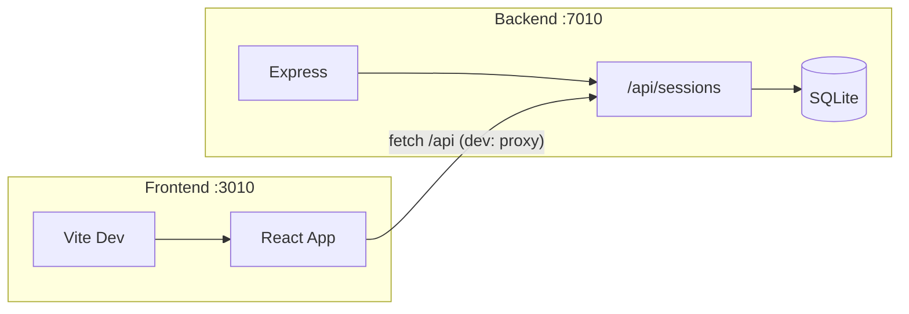

# SQLite 持久化与端口配置实现计划

## 当前状态

- **前端**：Vite + React 单页应用，训练记录类型为 `SessionRecord`（id, date, rounds）与 `RoundRecord`（round, prepTime, diveTime）。
- **持久化**：仅在 [src/App.tsx](src/App.tsx) 中用 `localStorage.getItem/setItem('apnea-sessions')` 读写，无后端。
- **依赖**：`package.json` 已包含 `express`、`better-sqlite3`、`dotenv`、`tsx`，可直接用于后端开发。

## 目标

- 用 SQLite 持久化训练记录，后端提供 REST API。
- 前端端口 **3010**，后端端口 **7010**。
- 本地测试与后续阿里云部署共用同一套前后端结构（部署时可由环境变量覆盖端口与数据库路径）。

---

## 架构概览

- 开发：Vite 在 3010，代理 `/api` 到 `http://localhost:7010`；后端单独 `node/tsx` 跑在 7010。
- 生产（阿里云）：可同机部署，Nginx 或 Express 静态资源 + 反向代理；后端 7010，SQLite 文件放在服务器磁盘（如 `/data/apnea.db`）。

---

## 1. 后端：Express + SQLite

**目录与文件：**

- 新建 `server/index.ts`：Express 入口，监听 `process.env.PORT || 7010`，挂载 CORS、JSON、路由。
- 新建 `server/db.ts`：初始化 better-sqlite3，数据库路径 `process.env.DATABASE_PATH || './data/apnea.db'`；建表脚本：
  - `sessions`：`id TEXT PRIMARY KEY, date TEXT NOT NULL`
  - `rounds`：`id INTEGER PRIMARY KEY AUTOINCREMENT, session_id TEXT NOT NULL, round INTEGER, prep_time INTEGER, dive_time INTEGER`，外键/索引按 session_id 查询。
- 新建 `server/routes/sessions.ts`：  
  - `GET /api/sessions`：返回 `{ sessions: SessionRecord[] }`，每条 session 的 rounds 由 rounds 表 join 或二次查询组装。  
  - `POST /api/sessions`：body `{ rounds: RoundRecord[] }`，生成 session id 与 date，写 sessions 一行 + 多行 rounds；返回 `{ session: SessionRecord }`。

**类型**：在 `server/` 内定义或复用与前端一致的 SessionRecord / RoundRecord 结构（可抽成 `server/types.ts`），保证 JSON 字段一致。

**脚本**：在 `package.json` 中增加 `"server": "tsx server/index.ts"` 或 `"server": "node --import tsx server/index.ts"`，便于本地 `npm run server`。

---

## 2. 前端：端口 3010 + 调用 API

**端口与代理：**

- 在 [vite.config.ts](vite.config.ts) 的 `server` 中设置 `port: 3010`，并增加 `proxy: { '/api': { target: 'http://localhost:7010', changeOrigin: true } }`，这样开发时前端 `fetch('/api/sessions')` 会落到 7010。

**替换 localStorage：**

- 在 [src/App.tsx](src/App.tsx) 中：
  - **加载**：`useEffect` 中改为 `fetch('/api/sessions').then(r => r.json()).then(data => setSessions(data.sessions || []))`，去掉对 `localStorage.getItem('apnea-sessions')` 的依赖。
  - **保存**：`saveSession` 中改为 `fetch('/api/sessions', { method: 'POST', headers: { 'Content-Type': 'application/json' }, body: JSON.stringify({ rounds }) })`，成功后从响应取新 session 并 `setSessions(prev => [newSession, ...prev])`，不再写 localStorage。

保留错误处理与加载状态（可选：简单 toast 或 setState 报错），避免静默失败。

---

## 3. 环境变量与部署

`**.env` / `.env.example`：**

- 增加后端端口与数据库路径，例如：  
`PORT=7010`  
`DATABASE_PATH=./data/apnea.db`  
- 前端端口已在 vite 中写死 3010；若希望可配置，可加 `VITE_PORT=3010` 并在 vite 的 `server.port` 中读取。

**阿里云部署：**

- 同一台机：运行后端（PORT=7010，DATABASE_PATH=/data/apnea.db 等），前端 `npm run build` 后由 Nginx 或 Express 的 `express.static('dist')` 提供；Nginx 将 `/api` 反向代理到 7010。
- 数据库文件需持久化卷或目录（如 `/data`），避免重启丢失。

---

## 4. 实施顺序建议

1. 建 `server/db.ts`、建表、实现 `server/routes/sessions.ts`（GET/POST）。
2. 实现 `server/index.ts`，加 `npm run server`，用 curl/Postman 验证 GET/POST。
3. 修改 vite：port 3010 + proxy `/api` → 7010。
4. 修改 App.tsx：加载与保存改为 fetch `/api/sessions`，移除 localStorage。
5. 更新 `.env.example`，在 README 中说明双端口启动方式（`npm run dev` + `npm run server`）及生产环境变量。

---

## 关键文件清单

| 用途      | 文件                                                         |
| ------- | ---------------------------------------------------------- |
| 后端入口    | 新建 `server/index.ts`                                       |
| 数据库与表   | 新建 `server/db.ts`                                          |
| 会话 API  | 新建 `server/routes/sessions.ts`                             |
| 前端端口与代理 | 修改 [vite.config.ts](vite.config.ts)                        |
| 前端数据源   | 修改 [src/App.tsx](src/App.tsx)（useEffect 拉取、saveSession 提交） |
| 环境示例    | 修改 [.env.example](.env.example)                            |

无需改动现有 UI 或训练流程逻辑，仅数据源从 localStorage 改为后端 API。